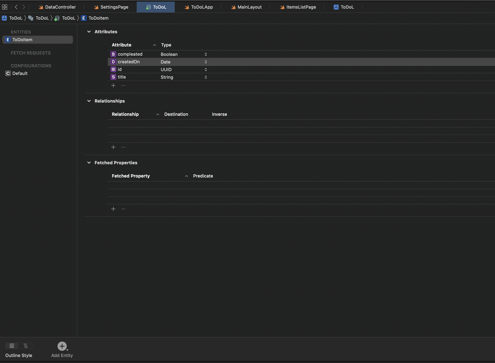

## The goal
Today I will show you how to setup core data in existing SwiftUi project

## Step 1 - Add data model
Create the model file by adding data model


## Step 2 - Add entity with properties




## Step 3 - Add DataController

Add this class that will allow access to core data storage

```swift
class DataController: ObservableObject{
    let container = NSPersistentContainer(name: "ToDoL")
    
    init(){
        container.loadPersistentStores{ description, error in
            if let error = error {
                print("Data failed: \(error.localizedDescription)")
            }            
        }
    }
}
```
## Step 4 - Add environment to get data context in any page

Add this to your app to have access to the data context in any page

```swift
struct ToDoLApp: App {
    @StateObject private var dataController = DataController()
    
    var body: some Scene {
        WindowGroup {
            MainLayout()
                .environment(\.managedObjectContext, dataController.container.viewContext)
        }
    }
}

```

## Step 5 - Example fetch

In this example will fetch the items by created date

```swift
@Environment(\.managedObjectContext) var managedobjectContext
@FetchRequest(sortDescriptors: [SortDescriptor(\.createdOn)]) var todoItems: FetchedResults<ToDoItem>
```


## Troubleshoot

If you get any error try to restart xCode and do a clean build by pressing &#8984; shift k
