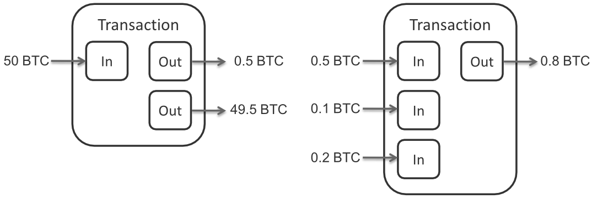

## Transaction in bitcoin

All bitcoin transactions have a fee attached to them. The reason for this is that in order for transaction to be processed it needs to be mined by a miner. The miner then takes a fee for using his computing power to processes transactions. The fee is determined by the complexity of the transaction. In other words a transaction consists of inputs and outputs the more inputs and outputs it has the more complex it is and the more the fee is raised thus the byte per price is raised.




## Step 1: Get number of inputs and outputs

You need to find a way to get the count of inputs and outputs. I am using electrum daemon but there are other ways.

``` csharp
var inputs = transactionData.Result.Inputs.Count();
var outputs = transactionData.Result.Outputs.Count();
```

## Step 2: Get the price per byte

``` csharp
var pricePerByte = (inputs * 148) + (outputs * 34) + 10;
```

Keep in mind that 148 should be 180 if the transaction is signed with uncompressed public key/P2PK. In our case we are using P2PKH.

# Step 3: Calculate the fee

``` csharp
var fee = (satoshis / pricePerByte) * pricePerByte;
```

Where satoshis is the price in satoshi not btc. The fee is then also satoshi.

# Bonus

Im including a bonus helper class that will allow you to parse satoshi in to BTC and vice versa. To make your life easier.

``` csharp
public class BitcoinCurrency
    {
        public static decimal BitcoinToSatoshi(string amountBtc)
        {
            var divisor = new Decimal(Math.Pow(10, 8));
            var decimalAmount = Decimal.Parse(amountBtc);
            return Decimal.Multiply(decimalAmount, divisor);
        }

        public static decimal BitcoinToSatoshi(decimal amountBtc)
        {
            var divisor = new Decimal(Math.Pow(10, 8));
            return Decimal.Multiply(amountBtc, divisor);
        }

        public static decimal SatoshiToBitcoin(string satoshiAmount) 
        {
            var divisor = new Decimal(Math.Pow(10, 8));
            var decimalAmount = Decimal.Parse(satoshiAmount);
            return Decimal.Divide(decimalAmount, divisor);
        }

        public static decimal SatoshiToBitcoin(decimal satoshiAmount)
        {
            var divisor = new Decimal(Math.Pow(10, 8));
            return Decimal.Divide(satoshiAmount, divisor);
        }
    }
```