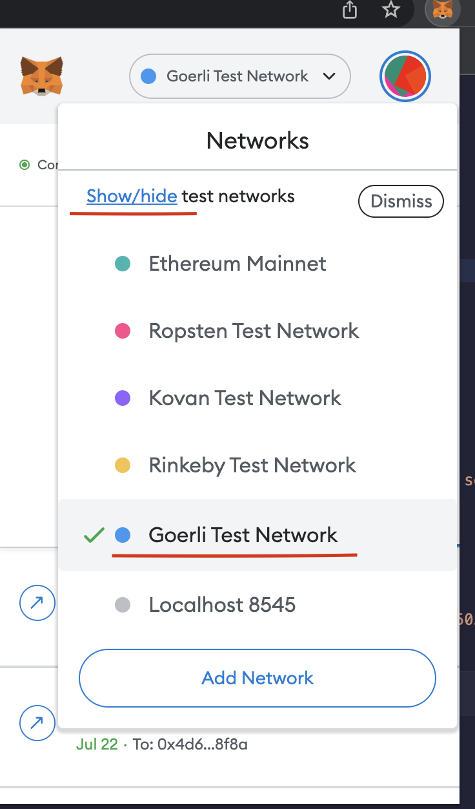
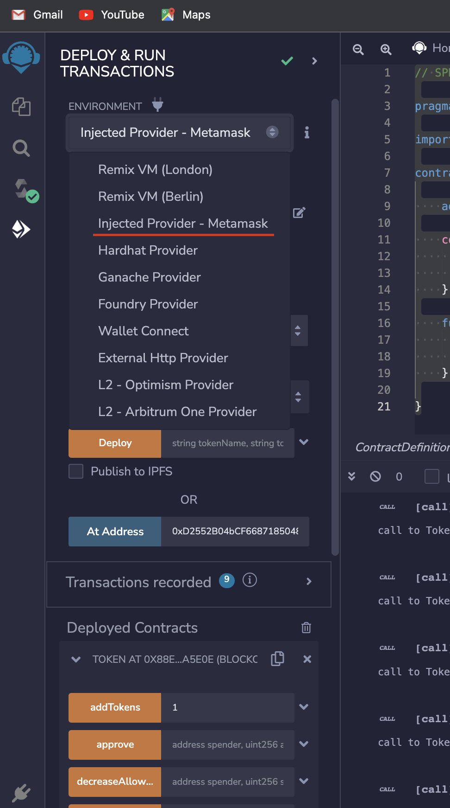
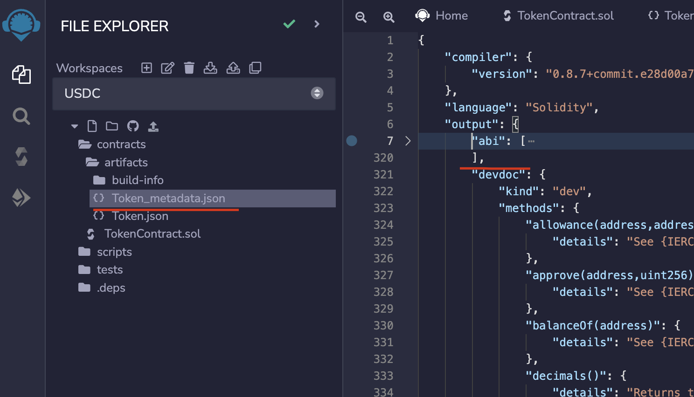
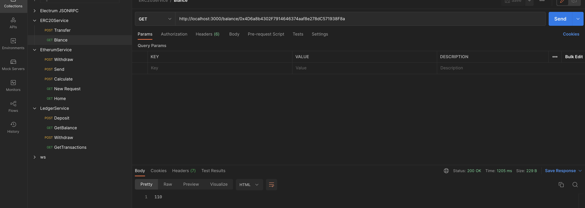
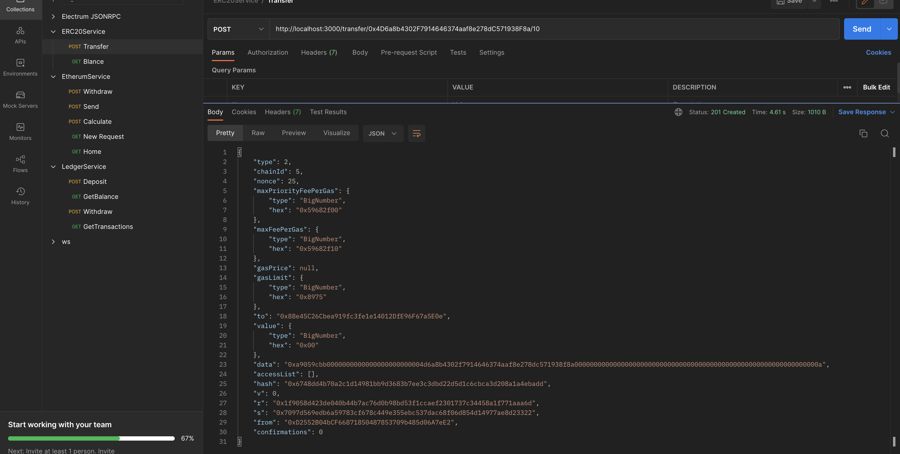

### Overview

Today we are going to deploy a smart contract for ERC20 token standard in ethereum blockchain and use it with js. We are going to use etherjs library to utilize the contract. This is meant to a how to set up things up post. 

# Step 1: Setup metamask

You need to install metamask as browser extension and set it up to a testnet of your choosing I am going to use goerli testnet. 



# Step 2: Write the contract on remix

We now need to write the actual contract on remix. Don't worry we are using ERC20 so its actually pretty easy. 
Go to remix https://remix.ethereum.org/ create workspace blank workspace or template with ERC20.
Create a new file folder does not matter and write this code.

```solidity
// SPDX-License-Identifier: GPL-3.0

pragma solidity >=0.7.0 <0.9.0;

import "@openzeppelin/contracts/token/ERC20/ERC20.sol";

contract Token is ERC20{

    address public owner;

    constructor(string memory tokenName, string memory tokenSymbol) ERC20(tokenName, tokenSymbol) {
        owner = msg.sender;
        _mint(owner, 10000000);
    }

    function addTokens(uint amount) public {
        require(msg.sender == owner);
        _mint(owner, amount);
    }

}
```

This contract implements the base ERC20 standard and also adds a function addTokens that lets you add as much tokens to the supply chain as you want.
As a side not if you wish to learn more about the ERC20 standard I am going to make separate blog post that goes in detail about the standard itself.

# Step 3: Deploy the contract

As I said we are going to use goerli tentnet you can use another if you wish.

Click ctrl + s to compile the contract then head over t deploy section.



Next click on deploy and it should open your metamask you will need to add some funds to your metamask address to deploy the contract however because there is a fee since the contract is a transaction it needs to be mined. You can a free faucet like this one: https://goerli-faucet.pk910.de . All you need to do is begin to mine the coins and after the value becomes 0.05 you can claim the tokens.

# Step 4: Set up js workspace

Im using a nestjs app in your case it could be a simple console app. We are going to use typescript. 

First install ethersjs with command `npm install ethers` 
Next create and interface ERC20 interface the idea is that you can plug in any ERC20 token and it will still work.

``` typescript
import { BigNumber } from "ethers"

export default interface ERC20Interface {

    balanceOf(address: string)

    transfer(address: string, amount: string)

    allowance(owner: string, spender: string)

    transferFrom(sender: string, recipient: string, amount: BigNumber)
}
```

Next implement the interface

```typescript
import { BigNumber, ethers, Wallet } from 'ethers';
import ERC20Interface from '../interfaces/erc20.interface';
import { ABI, ADDRESS_CONTRACT } from '../constnats/contract.constants';
import { PRIV_KEY } from '../constnats/wallet.constnats';
export default class ERC20 implements ERC20Interface {

    private readonly provider: ethers.providers.JsonRpcProvider;
    private readonly signer: Wallet;
    private readonly contract: ethers.Contract;

    constructor(provider: ethers.providers.JsonRpcProvider) {
        this.provider = provider;
        this.signer = new Wallet(PRIV_KEY, this.provider);
        this.contract = new ethers.Contract(ADDRESS_CONTRACT, ABI, this.signer);
    }

    async balanceOf(address: string): Promise<BigNumber> {
        return await this.contract.balanceOf(address);
    }
    async transfer(address: string, amount: string): Promise<any> {
        return await this.contract.transfer(address, amount);
    }
    allowance(owner: string, spender: string) {
        throw new Error('Method not implemented.');
    }
    transferFrom(sender: string, recipient: string, amount: BigNumber) {
        throw new Error('Method not implemented.');
    }
    totalSupply() {
        //await this.contract.totalSupply();
    }
}
```

# Step 5: Add constants

First lets add the abi. The abi is pretty much metadata description of functions on your contract. It can be found here.



Copy it to some constant in your app or if you want into a file.

Next you need the address of your contract which is your metamask address so just copy that
Next tou will need your private key for the signer again it can be found in meta mask in account details.

# Finale 
Thats it you can now call the functions I have left other functions not implemented so you can do it yourself and learn.

Example calls

As I said im using nestjs app so I just call it in the controllers trough postman you can use whatever you want.



